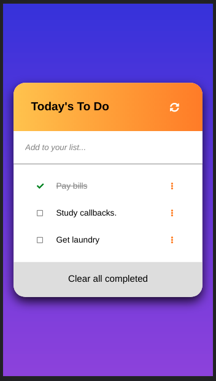
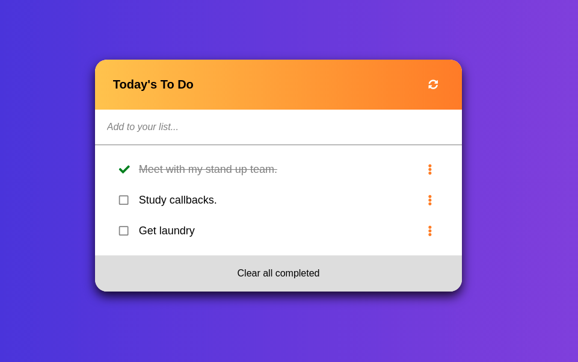

# To-Do-list

>	The To-Do list app is a minimalist planner to organize your day.

## Screenshots:

- Mobile version:

- Desktop version:

## Built With

### - Major languages:
  - HTML
  - CSS
  - JavaScript
### - Technologies used:
  - Webpack

## Learning objectives

- Use webpack to bundle JavaScript.
- Learn how to use proper ES6 syntax.
- Use ES6 modules to write modular JavaScript.

## Getting Started

- To get a local copy up and running follow these simple example steps:

### Prerequisites
  - Node
  - npm

### Setup

- Clone the repository with the command:

<code>
$ git clone https://github.com/andres-condezo/To-Do-list.git
</code>

---

- To install the dependencies run: 

<code>
$ npm Install
</code>

---

### Usage

- To create a development server built in run:

<code>
$ npm start
</code>

---

- The page will now automatically open in your browser. 

---

## Authors

👤 **Andrés Condezo Monge**

- GitHub: [@andres-condezo](https://github.com/andres-condezo)
- Twitter: [@andres_condezo](https://twitter.com/andres_condezo)
- LinkedIn: [andres-condezo](https://linkedin.com/in/andres-condezo)

## 🤝 Contributing

Contributions, issues, and feature requests are welcome!

Feel free to check the [issues page](../../issues/).

## Show your support

Give a ⭐️ if you like this project!

## Acknowledgments

- Icons from fontAwesome.

## 📝 License

This project is [MIT](./MIT.md) licensed.
